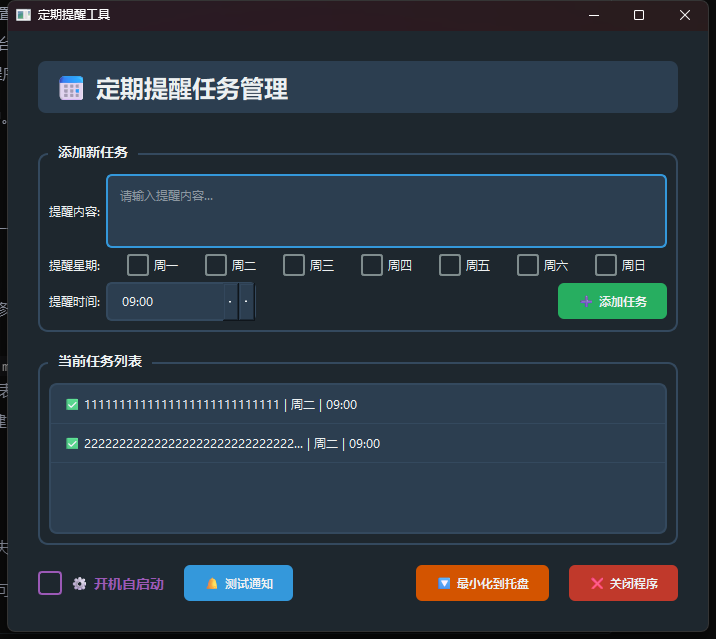

# 桌面计划任务工具包

这是一个基于 PyQt6 的 Windows 托盘应用程序，允许用户设置自定义时间以接收桌面通知。

## 功能

- 系统托盘图标，包含“设置”和“退出”选项。
- 允许用户通过设置对话框自定义通知时间。
- 在设定的时间显示 Windows 通知。
- 支持开机自启动（通过注册表）。
- 使用 `QSettings` 持久化存储用户设置。
- 简单的单实例检查，防止多个应用副本运行。



## 如何运行

1.  **安装依赖:**

    ```bash
    uv sync 
    ```
2.  **运行应用程序:**

    ```bash
    uv run main.py
    ```

    应用程序启动后，您会在系统托盘中看到它的图标。

## 如何构建可执行文件 (使用 PyInstaller)
1. **创建图标:**

    确保在项目根目录中有一个名为 `icon.png` 的图标文件。如果该文件不存在，应用程序将尝试创建一个虚拟图标（需要 Pillow 库）或使用系统默认图标。

2. **构建:**

   使用 pyinstaller 代码带包为exe可执行文件的命令：
    ```shell
    pyinstaller --name ScheduledTaskApp_win64 --windowed --icon=assets/icon.ico --add-data="assets/icon.ico;./assets" --add-data="data/tasks_data.json;./data" main.py
    ```
    ~~使用 pyinstaller 代码带包为app/dmg可执行文件的命令(目前代码仍不支持macos系统)~~
    ```bash
    pyinstaller  --name ScheduledTaskApp --icon=assets/icon.icns --noconsole  --add-data="assets/icon.icns:./assets" --add-data="data/tasks_data.json:./data" main.py
    ```
    -   `--name ScheduledTaskApp`: 设置可执行文件的名称。
    -   `--windowed`: 创建一个无控制台窗口的应用程序。
    -   `--icon=icon.png`: 指定应用程序图标。

    可执行文件将位于 `dist` 文件夹中。

## 注意事项

-   **图标:** 为了获得最佳效果，请提供一个 `icon.png` 文件。如果 Pillow 未安装且 `icon.png` 缺失，应用程序可能无法正确显示图标。
-   **开机自启动:** 
    -   在 Windows 上，此功能通过修改注册表实现 (`HKEY_CURRENT_USER\Software\Microsoft\Windows\CurrentVersion\Run`)。
    -   如果以脚本形式运行 (`python main.py`)，它会创建一个 `.bat` 文件来实现自启动。如果打包成可执行文件，则直接添加可执行文件路径到注册表。
-   **单实例:** 通过在应用程序目录中创建 `.lock` 文件来实现简单的单实例检查。这可以防止意外运行多个应用程序实例。

## 依赖项

-   PyQt6
-   Pillow (可选, 用于在 `icon.png` 缺失时创建虚拟图标)

这些依赖项列在 `pyproject.toml` 中，可以使用 `uv` 进行安装。
